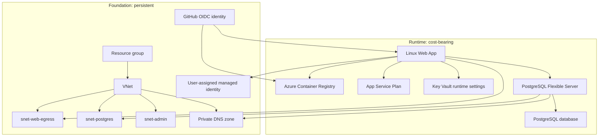

# Infrastructure lifecycle

The Terraform project is split by lifecycle rather than by Azure service type. The goal is to keep low/no cost foundational resources stable while allowing expensive runtime resources to be stopped or destroyed when the system is not actively used.

## Lifecycle layers



## Foundation responsibilities

The foundation layer lives in `infra/foundation` and is intended to remain deployed.

It owns:

- existing resource group, read as data;
- VNet;
- App Service integration subnet;
- PostgreSQL delegated subnet;
- admin subnet for private operational access patterns;
- PostgreSQL private DNS zone and VNet link;
- user-assigned managed identity for the Web App;
- GitHub Actions Entra application, service principal, and federated credential;
- foundational RBAC such as resource group read access for the deployment identity.

These resources are not expensive compared with runtime compute and should not be destroyed during ordinary cost-control cycles.

## Runtime responsibilities

The runtime layer lives in `infra/runtime` and is intended to be safe to destroy and recreate.

It owns:

- Azure Container Registry;
- App Service plan;
- Linux Web App;
- Web App VNet integration;
- runtime Key Vault and database connection secret;
- PostgreSQL Flexible Server;
- PostgreSQL database;
- runtime RBAC such as `AcrPush`, `AcrPull`, Key Vault access, and Web App contributor access.

These resources carry most of the active cost. Destroying runtime removes the App Service plan and PostgreSQL server while preserving the network and identity backbone.

## Why identities stay in foundation

User-assigned managed identities are lifecycle-sensitive. Recreating a managed identity changes its principal/object ID. PostgreSQL Entra principal mappings and Azure RBAC assignments depend on those IDs.

Keeping identities in foundation preserves:

- PostgreSQL role mappings;
- Key Vault and ACR RBAC assumptions;
- operational audit continuity;
- deployment identity stability.

Destroying and recreating identities can invalidate PostgreSQL database principals created with `pgaadauth_create_principal`.

## Why networking stays in foundation

Private networking is also lifecycle-sensitive. VNet, subnet, and private DNS changes can affect database name resolution, delegated subnet placement, and future private access paths.

Keeping networking in foundation preserves:

- private DNS zone continuity;
- delegated subnet configuration;
- App Service integration subnet identity;
- admin subnet availability;
- a stable place for jump hosts, private runners, or migration jobs.

Runtime can be recreated into the same network boundary without rebuilding the private access model.

## State separation

Foundation and runtime use separate Terraform roots and separate state files:

- foundation state: long-lived, rarely destroyed, but it does not own the resource group lifecycle;
- runtime state: applied and destroyed more often.

This avoids a monolithic state where a routine runtime destroy could accidentally remove GitHub OIDC, managed identities, or private DNS.

The runtime layer uses Azure data sources to discover foundation resources by name. It does not hardcode resource IDs.

## Operational workflows

Initial environment:

```bash
cd infra/foundation
terraform init
terraform plan
terraform apply

cd ../runtime
terraform init
terraform plan
terraform apply
```

Pause compute without deleting runtime state:

```bash
az postgres flexible-server stop \
  --resource-group rg-devops-tracker-dev \
  --name psql-devops-tracker-29193-swn

az webapp stop \
  --resource-group rg-devops-tracker-dev \
  --name devops-tracker-29193
```

Remove runtime cost-bearing resources:

```bash
cd infra/runtime
terraform destroy
```

Do not run `terraform destroy` in `infra/foundation` during normal cleanup.

## Cost optimization strategy

There are two cost controls:

- Stop PostgreSQL when the environment may be needed again soon.
- Destroy runtime when the environment is not needed.

Stopping PostgreSQL stops compute billing but keeps storage and backup billing. Destroying runtime removes the App Service plan and PostgreSQL server. Foundation remains deployed to preserve identity and networking continuity.
