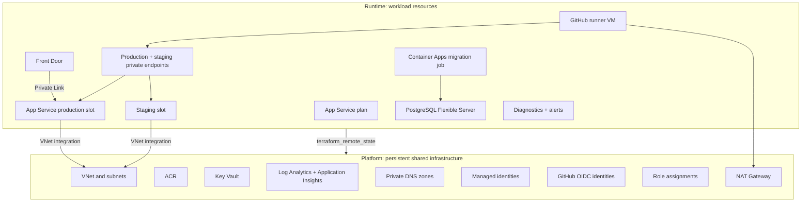

# Infrastructure lifecycle

Terraform is split by lifecycle rather than by Azure service type. Platform keeps persistent shared infrastructure stable; runtime contains workload resources that carry most active cost.

## Lifecycle layers



## Platform responsibilities

`infra/platform` owns:

- existing resource group lookup;
- VNet and subnets for App Service egress, PostgreSQL, admin access, Container Apps, private endpoints, and GitHub runner;
- ACR, Key Vault, Log Analytics, and Application Insights;
- PostgreSQL and App Service private DNS zones;
- user-assigned managed identities for App Service, migration job, and GitHub runner;
- GitHub OIDC deployment/operator identities;
- role assignments that belong to shared infrastructure;
- NAT Gateway and static outbound IP for the runner subnet.

Do not destroy this layer during normal cleanup. Recreating it can change identity principal IDs, private DNS links, and the runner network backbone.

## Runtime responsibilities

`infra/runtime` owns:

- App Service plan, production Web App, and staging slot;
- PostgreSQL Flexible Server and database;
- Container Apps Environment and Flyway migration job;
- Front Door Premium, WAF policy, route, and Private Link origin;
- production and staging App Service private endpoints;
- Ubuntu self-hosted GitHub runner VM with no public IP;
- workload diagnostic settings, alerting, and RBAC.

Runtime can be destroyed to remove most active cost while preserving platform.

## State separation

Platform and runtime use separate Terraform roots and separate state files. Runtime reads platform outputs through `terraform_remote_state`; it should not hardcode platform resource IDs.

This split keeps routine workload teardown from removing deployment identity, managed identities, ACR, Key Vault, DNS, NAT, or the VNet.

## Operating model

Initial apply order:

```bash
cd infra/platform
terraform init
terraform apply

cd ../runtime
terraform init
terraform apply
```

Cost control:

- stop PostgreSQL and App Service for short idle periods;
- destroy `infra/runtime` for longer idle periods;
- keep `infra/platform` unless retiring the project.

The next planned platform phase is AKS. The current split is intended to remain useful because networking, identity, monitoring, and private ingress foundations can be reused or extended.
