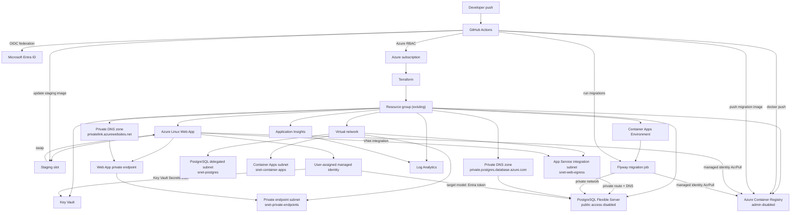

# Architecture overview

DevOps tracker is a containerized Node.js API deployed to Azure App Service. The application is intentionally small; the platform architecture is the primary object of study. The system models a production-oriented Azure deployment using Terraform, GitHub Actions OIDC, private PostgreSQL networking, managed identity based access patterns, migration jobs, and Azure Monitor.

## Resource model

The Azure estate is split into two Terraform lifecycle roots:

- `infra/foundation` manages persistent, low/no cost resources such as the resource group lookup, VNet, subnets, private DNS zones, user-assigned managed identities, and GitHub Actions OIDC identity.
- `infra/runtime` manages cost-bearing resources such as PostgreSQL Flexible Server, App Service plan, Web App and staging slot, ACR, Container Apps Environment, migration job, runtime Key Vault configuration, monitoring, alerts, private endpoint, and runtime RBAC.

The infra layer manages:

- Persistent resource group read as data in the foundation layer.
- Azure Container Registry with admin credentials disabled.
- Linux App Service plan, Linux Web App, and staging deployment slot.
- User-assigned managed identity attached to the Web App from the foundation layer.
- Separate user-assigned managed identity for the migration job.
- VNet with separate App Service egress, PostgreSQL, admin, Container Apps, and private endpoint subnets.
- Private DNS zones for PostgreSQL name resolution and Web App private endpoint resolution.
- Azure Database for PostgreSQL Flexible Server with public access disabled.
- PostgreSQL database.
- Container Apps Environment and manual Container Apps Job for Flyway migrations.
- Key Vault and RBAC permissions for secret access.
- Log Analytics, Application Insights, diagnostic settings, action group, and scheduled query alert.
- Private endpoint for Web App inbound private access.
- RBAC assignments for GitHub Actions and Web App managed identity across foundation and runtime.

## Architecture diagram



## Resource interaction flow

GitHub Actions is the deployment actor. It receives an OIDC token from GitHub and exchanges that token with Microsoft Entra ID through the federated credential created in the bootstrap layer. No Azure client secret is stored in GitHub.

After login, GitHub Actions can:

- run Terraform against the application infrastructure;
- log in to ACR through Azure CLI;
- build and push the application image;
- build and push the Flyway migration image;
- update and run the Container Apps migration job;
- update the staging slot container configuration;
- swap staging into production after health checks pass.

The Web App is the runtime actor. It pulls its container image from ACR through a managed identity with `AcrPull`. It reaches PostgreSQL through regional VNet integration and private DNS. For the production database authentication target, the Web App obtains an Entra access token through managed identity and uses that token as the PostgreSQL password. PostgreSQL maps the Entra principal to a database role.

The migration job is a separate runtime actor. It runs in the Container Apps Environment, pulls its Flyway image from ACR through its own managed identity, and connects to PostgreSQL through the private network before the Web App slot swap.

## Networking boundaries

PostgreSQL is private-only. The Flexible Server is deployed into a delegated subnet and has `public_network_access_enabled = false`. There are no public PostgreSQL firewall rules for client IPs.

App Service does not live inside the VNet in the same way as a VM. Instead, regional VNet integration attaches outbound traffic to the delegated App Service subnet. That allows the Web App to resolve and route to private Azure services in the linked network.

Private DNS is part of the trust boundary. Without the linked PostgreSQL zone, the Web App and migration job may know the PostgreSQL hostname but will not resolve it to the private address required for connectivity. The Web App private endpoint also depends on the `privatelink.azurewebsites.net` zone for private inbound name resolution.

## Identity boundaries

There are three important identity boundaries:

- GitHub Actions deployment identity: created by `infra/foundation`, granted only the Azure RBAC required by infra.
- Web App user-assigned managed identity: used for ACR pull, Key Vault secret access, and the target PostgreSQL Entra authentication flow.
- Migration job user-assigned managed identity: used for ACR pull by the Container Apps Job.
- Human/operator identity: used for Terraform execution and PostgreSQL administration tasks that are not expressible cleanly through Terraform.

These boundaries prevent the deployment identity from becoming the runtime identity and prevent the application from needing static cloud credentials.

## Deployment flow

The deployment flow is intentionally credential-light:

1. A developer pushes to the configured branch.
2. GitHub Actions requests an OIDC token.
3. `azure/login` exchanges the GitHub token for Azure access.
4. Terraform can provision or update Azure resources.
5. Docker builds the application image.
6. The workflow pushes the app image to ACR using Azure CLI authentication.
7. The workflow builds and pushes the Flyway migration image.
8. The workflow updates and starts the Container Apps migration job.
9. After migrations succeed, the workflow updates the staging slot image.
10. The workflow restarts and verifies the staging slot.
11. The workflow swaps staging into production.
12. App Service pulls the image using its managed identity and establishes database connectivity through the private network.

## Authentication flow

The Web App runtime uses managed identity based PostgreSQL authentication:

```text
Web App
  -> managed identity
  -> Entra access token for PostgreSQL
  -> private PostgreSQL endpoint
  -> mapped PostgreSQL role
```

This model still requires database-side setup. Entra authentication enables token validation, but a PostgreSQL role must exist for the principal. Azure provides `pgaadauth_create_principal` for that mapping.

Password authentication remains enabled for bootstrap and migration operations. The migration job currently uses PostgreSQL administrator credentials while the Web App runtime path uses the Entra token flow.
