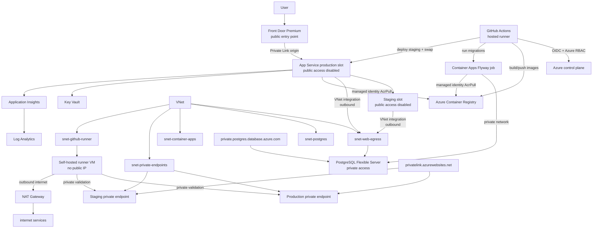

# Architecture overview

DevOps tracker is a containerized Node.js API deployed to Azure App Service. The application is intentionally small; the platform is the learning target. The system models a production-inspired Azure deployment using Terraform, GitHub Actions OIDC, private networking, managed identities, staged deployment, and Azure Monitor.

- Region: `swedencentral`
- Environment: `dev`
- Deployment strategy: staging slot swap

The staging slot is not a separate environment. It is a deployment slot inside `dev` used to validate a release candidate before swapping it into production.

## Resource model

Terraform is split into two lifecycle roots:

- `infra/platform` manages persistent shared infrastructure: VNet/subnets, ACR, Key Vault, monitoring, private DNS zones, managed identities, GitHub OIDC identities, role assignments, and NAT Gateway.
- `infra/runtime` manages workload infrastructure: App Service, staging slot, PostgreSQL Flexible Server, Container Apps migration job, Front Door, private endpoints, GitHub self-hosted runner VM, workload diagnostics, alerts, and workload RBAC.

Runtime reads platform outputs through `terraform_remote_state`. This preserves network and identity continuity while allowing cost-bearing runtime resources to be recreated.

## Architecture diagram



## Traffic flows

User traffic:

```text
User
  -> Front Door
  -> Private Link
  -> App Service
```

CI validation traffic:

```text
GitHub Actions
  -> self-hosted runner inside VNet
  -> private endpoint
  -> App Service
```

Runner outbound traffic:

```text
runner subnet
  -> NAT Gateway
  -> internet services
```

## Networking boundaries

App Service VNet integration is outbound. It allows the app and staging slot to reach private resources in the VNet, such as PostgreSQL, but it does not make App Service itself live inside the VNet.

Private endpoints are inbound. They allow VNet resources, including the self-hosted runner, to reach production and staging App Service hosts privately. Both production and staging use the shared private DNS zone `privatelink.azurewebsites.net`.

Front Door is the public edge. App Service direct public access is disabled, so public user traffic should enter through Front Door and then use Private Link to reach App Service.

NAT Gateway is attached to the runner subnet for centralized outbound internet access. It is outbound only and does not enforce security policy.

## Deployment actors

- GitHub-hosted runners perform build/push, migrations, staging deployment, and slot swap through Azure APIs using OIDC.
- The self-hosted runner exists primarily for private network validation after staging deployment and after production swap.
- App Service uses a user-assigned managed identity for ACR image pull and the target PostgreSQL Entra authentication flow.
- The migration job uses a separate user-assigned managed identity for ACR image pull.

## Database access

PostgreSQL Flexible Server is private-only. The Web App reaches it through VNet integration and private DNS. The current production authentication target is managed identity to Entra token to PostgreSQL role. Password authentication remains available for bootstrap and migration operations.
