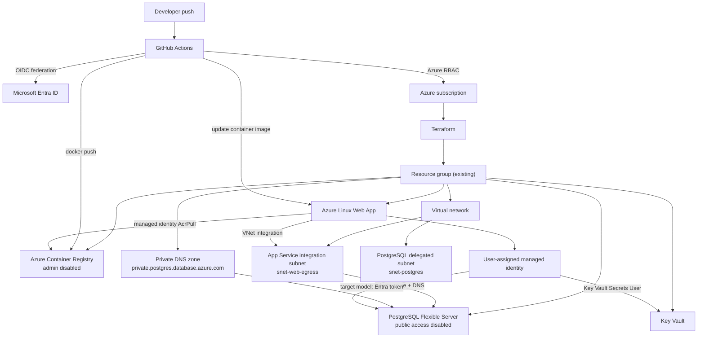

# Architecture overview

DevOps tracker is a containerized Node.js API deployed to Azure App Service. The application is intentionally small; the platform architecture is the primary object of study. The system models a production-oriented Azure deployment using Terraform, GitHub Actions OIDC, private PostgreSQL networking, and managed identity based access patterns.

## Resource model

The Azure estate is split into two Terraform lifecycle roots:

- `infra/foundation` manages persistent, low/no cost resources such as the resource group, VNet, subnets, private DNS zone, user-assigned managed identity, and GitHub Actions OIDC identity.
- `infra/runtime` manages cost-bearing resources such as PostgreSQL Flexible Server, App Service plan, Web App, ACR, runtime Key Vault secret configuration, and runtime RBAC.

The infra layer manages:

- Persistent resource group read as data in the foundation layer.
- Azure Container Registry with admin credentials disabled.
- Linux App Service plan and Linux Web App.
- User-assigned managed identity attached to the Web App from the foundation layer.
- VNet with separate App Service egress and PostgreSQL subnets.
- Private DNS zone for PostgreSQL name resolution.
- Azure Database for PostgreSQL Flexible Server with public access disabled.
- PostgreSQL database.
- Key Vault and RBAC permissions for secret access.
- RBAC assignments for GitHub Actions and Web App managed identity across foundation and runtime.

## Architecture diagram



## Resource interaction flow

GitHub Actions is the deployment actor. It receives an OIDC token from GitHub and exchanges that token with Microsoft Entra ID through the federated credential created in the bootstrap layer. No Azure client secret is stored in GitHub.

After login, GitHub Actions can:

- run Terraform against the application infrastructure;
- log in to ACR through Azure CLI;
- build and push the application image;
- update the Web App container configuration.

The Web App is the runtime actor. It pulls its container image from ACR through a managed identity with `AcrPull`. It reaches PostgreSQL through regional VNet integration and private DNS. For the production database authentication target, the Web App obtains an Entra access token through managed identity and uses that token as the PostgreSQL password. PostgreSQL maps the Entra principal to a database role.

## Networking boundaries

PostgreSQL is private-only. The Flexible Server is deployed into a delegated subnet and has `public_network_access_enabled = false`. There are no public PostgreSQL firewall rules for client IPs.

App Service does not live inside the VNet in the same way as a VM. Instead, regional VNet integration attaches outbound traffic to the delegated App Service subnet. That allows the Web App to resolve and route to private Azure services in the linked network.

The private DNS zone is part of the trust boundary. Without the linked zone, the Web App may know the PostgreSQL hostname but will not resolve it to the private address required for connectivity.

## Identity boundaries

There are three important identity boundaries:

- GitHub Actions deployment identity: created by `infra/foundation`, granted only the Azure RBAC required by infra.
- Web App user-assigned managed identity: used for ACR pull, Key Vault secret access, and the target PostgreSQL Entra authentication flow.
- Human/operator identity: used for Terraform execution and PostgreSQL administration tasks that are not expressible cleanly through Terraform.

These boundaries prevent the deployment identity from becoming the runtime identity and prevent the application from needing static cloud credentials.

## Deployment flow

The deployment flow is intentionally credential-light:

1. A developer pushes to the configured branch.
2. GitHub Actions requests an OIDC token.
3. `azure/login` exchanges the GitHub token for Azure access.
4. Terraform can provision or update Azure resources.
5. Docker builds the application image.
6. The workflow pushes the image to ACR using Azure CLI authentication.
7. The workflow updates the Web App container image reference.
8. App Service restarts and pulls the image using its managed identity.
9. The application starts and establishes database connectivity through the private network.

## Authentication flow

The current application supports a transitional `DATABASE_URL` configuration, with the secret stored in Key Vault and exposed through an App Service Key Vault reference.

The production target removes the static database password from runtime:

```text
Web App
  -> managed identity
  -> Entra access token for PostgreSQL
  -> private PostgreSQL endpoint
  -> mapped PostgreSQL role
```

This model still requires database-side setup. Entra authentication enables token validation, but a PostgreSQL role must exist for the principal. Azure provides `pgaadauth_create_principal` for that mapping.
